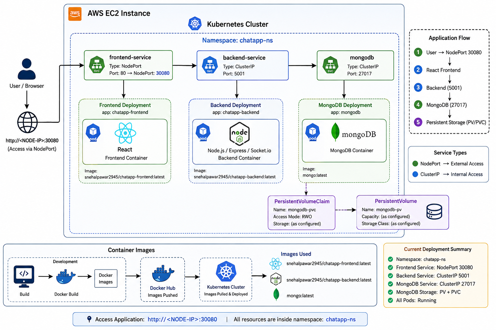
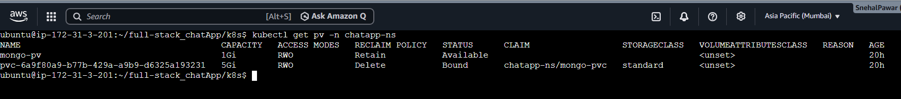
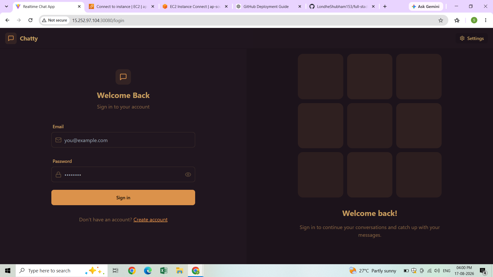
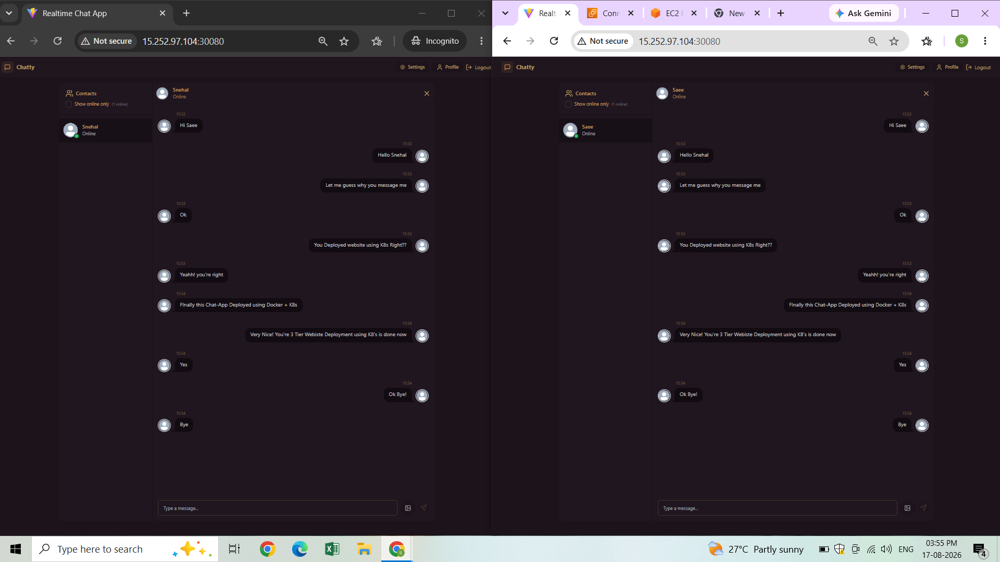
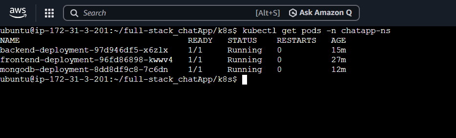

# 💬 Full-Stack Chat Application — Kubernetes Deployment


A containerized full-stack chat application deployed on **Kubernetes**, demonstrating Docker containerization, Kubernetes workloads, service networking, persistent MongoDB storage, and deployment on AWS infrastructure.

---

## 📌 Project Overview

This project focuses on taking a full-stack chat application and deploying it as a **multi-container Kubernetes application**.

The deployment includes:

- React frontend
- Node.js + Express + Socket.io backend
- MongoDB database
- Docker containers
- Kubernetes Deployments
- Kubernetes Services
- PersistentVolume and PersistentVolumeClaim
- Kubernetes Namespace
- AWS EC2 infrastructure

All application resources are deployed inside the:

```text
chatapp-ns
````

---

# 🏗️ Architecture

<p align="center">
  
</p>

### Application Flow

```text
                         User
                           │
                           ▼
                  NodePort :30080
                           │
                           ▼
                  ┌────────────────┐
                  │ React Frontend │
                  │     Port 80    │
                  └───────┬────────┘
                          │
                          ▼
                  ┌────────────────┐
                  │ Node.js Backend│
                  │    Port 5001   │
                  └───────┬────────┘
                          │
                          ▼
                  ┌────────────────┐
                  │    MongoDB     │
                  │    Port 27017  │
                  └───────┬────────┘
                          │
                          ▼
                  Persistent Storage
```

### Kubernetes Resource Flow

```text
Namespace
   │
   ├── Frontend Deployment
   │      └── Frontend Pod
   │
   ├── Backend Deployment
   │      └── Backend Pod
   │
   ├── MongoDB Deployment
   │      └── MongoDB Pod
   │
   ├── Frontend NodePort Service
   │
   ├── Backend ClusterIP Service
   │
   ├── MongoDB ClusterIP Service
   │
   ├── PersistentVolume
   │
   └── PersistentVolumeClaim
```

---

# 🛠️ Technology Stack

| Category         | Technology                               |
| ---------------- | ---------------------------------------- |
| Frontend         | React                                    |
| Backend          | Node.js, Express, Socket.io              |
| Database         | MongoDB                                  |
| Containerization | Docker                                   |
| Orchestration    | Kubernetes                               |
| Infrastructure   | AWS EC2                                  |
| Storage          | PersistentVolume + PersistentVolumeClaim |
| CLI / Management | kubectl                                  |
| Version Control  | Git                                      |

---

# ☸️ Kubernetes Components

| Component             | Kubernetes Resource | Configuration       |
| --------------------- | ------------------- | ------------------- |
| Frontend              | Deployment + Pod    | NodePort `80:30080` |
| Backend               | Deployment + Pod    | ClusterIP `5001`    |
| MongoDB               | Deployment + Pod    | ClusterIP `27017`   |
| Database Storage      | PV + PVC            | Persistent storage  |
| Application Isolation | Namespace           | `chatapp-ns`        |

---

# 🐳 Container Images

The application uses custom Docker images for the frontend and backend:

```text
Frontend → snehalpawar2945/chatapp-frontend:latest
Backend  → snehalpawar2945/chatapp-backend:latest
Database → mongo:latest
```

---

# 💾 Persistent Storage

MongoDB uses Kubernetes persistent storage through:

```text
PersistentVolume
       │
       ▼
PersistentVolumeClaim
       │
       ▼
MongoDB
```

This separates the database workload from the application's container lifecycle and demonstrates the use of Kubernetes persistent storage.

<p align="center">
  
</p>

---

# 🚀 Deployment

## 1. Clone the Repository

```bash
git clone https://github.com/snehalpawar29/full-stack-chatApp.git
cd full-stack-chatApp
```

---

## 2. Apply Kubernetes Manifests

```bash
kubectl apply -f k8s/
```

---

## 3. Verify Kubernetes Resources

Check all workloads:

```bash
kubectl get all -n chatapp-ns -o wide
```

Check PersistentVolumes:

```bash
kubectl get pv
```

Check PersistentVolumeClaims:

```bash
kubectl get pvc -n chatapp-ns
```

---

## 4. Access the Application

The frontend is exposed through a Kubernetes NodePort:

```text
http://<NODE-IP>:30080
```

---

# 📸 Deployment Evidence

## 🌐 Running Application

<p align="center">
  
</p>

<p align="center">
  
</p>

---

## ☸️ Kubernetes Workloads

<p align="center">
  
</p>

The Kubernetes workloads can be verified using:

```bash
kubectl get all -n chatapp-ns -o wide
```

---

## 💾 Persistent Storage

<p align="center">
  
</p>

---

# 🔍 DevOps Implementation

This project provided hands-on experience with:

* 🐳 Building custom Docker images
* ☸️ Deploying multi-container applications to Kubernetes
* 🌐 Configuring NodePort and ClusterIP Services
* 💾 Implementing MongoDB persistent storage
* 🏷️ Isolating application resources using Kubernetes Namespaces
* 🔍 Inspecting Pods, Deployments, Services, PVs, and PVCs using `kubectl`
* ☁️ Running the Kubernetes environment on AWS infrastructure

---

# 📂 Project Structure

```text
full-stack-chatApp/
│
├── k8s/
│   ├── namespace.yml
│   ├── deployment.yml
│   ├── db_deployment.yml
│   ├── db-svc.yml
│   ├── db-pv.yml
│   ├── db-pvc.yml
│   └── ...
│
├── screenshots/
│   ├── architecture.png
│   ├── application-1.png
│   ├── application-2.png
│   ├── kubernetes-pods.png
│   ├── kubernetes-deployments.png
│   ├── kubernetes-services.png
│   ├── persistent-storage.png
│   └── persistent-storage-claim.png
│
├── INSTRUCTIONS.md
└── README.md
```

---

# 📖 Detailed Instructions

For complete setup, deployment, troubleshooting, and cleanup instructions:

👉 **[Read INSTRUCTIONS.md](INSTRUCTIONS.md)**

---

# 🎯 Project Outcome

The project demonstrates the deployment of a full-stack application using Docker and Kubernetes:

```text
React
  │
  ▼
Docker Container
  │
  ▼
Kubernetes
  │
  ├── Frontend
  ├── Backend
  └── MongoDB
         │
         ▼
   Persistent Storage
```

The application was deployed and validated through Kubernetes workloads, Services, persistent storage resources, and the running application.

---

# 📚 Original Application

This project is based on the open-source **Full-Stack Chat App** by LondheShubham153.

The focus of this repository is the **Dockerization and Kubernetes deployment** of the application.

---

# 👨‍💻 Author

## Snehal Pawar

**Aspiring DevOps Engineer | AWS | Docker | Kubernetes | Terraform | Jenkins**

GitHub: [snehalpawar29](https://github.com/snehalpawar29)

---

⭐ If you found this project useful, consider giving it a star!
